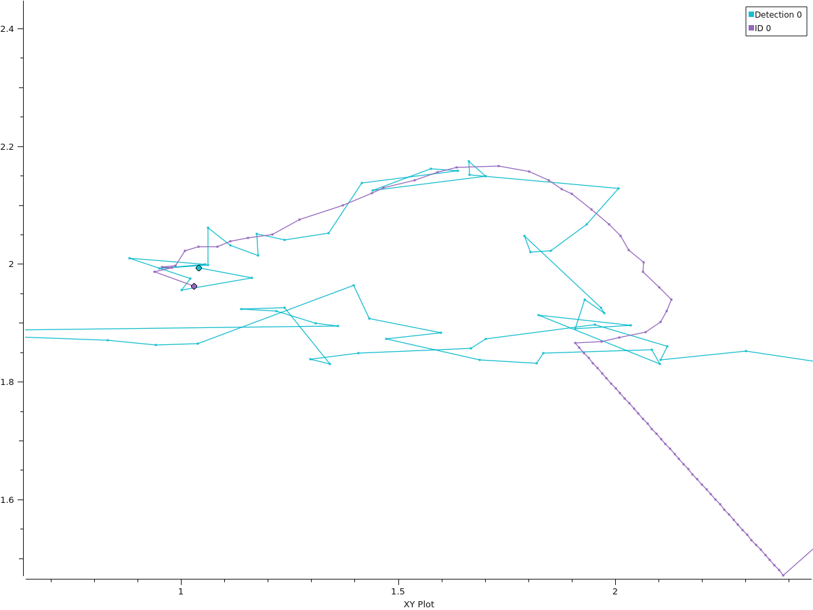

# bb_tracker

This project, titled *Radar Tracking and Object Detection*, was done as part of a 5 ECTS special course in collaboration with AgriRobot in Fall 2023.

The tracker is largely based on the Simple, Online, and Realtime Tracking (SORT) developed by [Bewley et al., 2018](http://arxiv.org/abs/1602.00763). The multi-object tracker uses a Kalman Filter for each object to be tracked, and uses the Hungarian algorithm to assign the multiple detections to multiple trackers. Detailed explanations are contained in the report found in the `media` folder.

The SORT tracker initialises with the following parameters:

- `freq`: 5 Hz (to match pipeline frequency)
- `min_hits`: 3 s
- `max_age`: 10 s
- `max_speed`: 2.0 m/s
- `iou_threshold`: 0.01
- `dt`: Equals to `1/freq`. It is used in the state model of the Kalman filter


Valid trackers satisfy the following conditions:

$hit\_streak > min\_hits$ <br>
$time\_since\_update  < max\_age$ <br>
$|\dot{x}|,|\dot{y}| < max\_speed$

New trackers are given an ID incremented from the last created tracker. When there are no trackers in memory, the count resets to 0, and the next tracker is assigned ID 0. This is necessary for the marker_pub node to work and produce markers on RViz. 

## ROS2 Information

All topics listed are prefixed with `/tractor/radar/dynamic/obstacle_detection`. Topics with `PointedStamped` message types are only used for plotting with PlotJuggler and not used by RViz. The RViz configuration file is included here as `tracking.rviz`.

__bb_2d_tracker node__: Node to process detections, predict and update trackers.

- Subscribed Topics
  - `/clustering/bb_2d` with messages of type `PolygonArrayStamped`
- Published Topics
  - `/tracking/bb_2d` with messages of type `PolygonArrayStamped`
  - `/tracking/bb_2d/center` with messages of type `PointStamped`

__tracker_marker_pub node__: Node to publish markers for each tracker ID. There are separate marker topics for undetected and detected objects.

- Subscribed Topics
  - `/tracking/bb_2d` with messages of type `PolygonArrayStamped`
- Published Topics (each topic is suffixed with the ID of the corresponding tracker)
  - `/tracking/bb_2d/detected/marker_poly` with messages of type `PolygonStamped`
  - `/tracking/bb_2d/undetected/marker_poly` with messages of type `PolygonStamped`
  - `/tracking/bb_2d/marker_point` with messages of type `PointStamped`

__dummy_pub node:__ Node to publish dummy data to test the tracker. Circular, straight, or sinuisoidal paths can be generated with a publishing rate of all the time, simulated occlusion, or at regular intervals.

- Published Topics
  - `/clustering/bb_2d_gt` with messages of type `PolygonStamped`
  - `/clustering/bb_2d` with messages of type `PolygonArrayStamped`
  - `/clustering/bb_2d_gt/center` with messages of type `PointStamped`
  - `/clustering/bb_2d/center` with messages of type `PointStamped`

The topics were published with `frame_id = 'base_link'`. It might be more interpretable if the `frame_id` is changed to `map` instead for future development.

## Running the Repository

Start the development container:

```bash
vagrant up && vagrant ssh
```

Clone the repository into your ROS2 workspace. Change directory to the ros2_ws and build it:

```bash
cd ~/ws/ros_ws
colcon build --packages-select bb_tracker
```

In the current and all new terminal sessions, source the setup file:

```bash
cd ~/ws/ros_ws && source install/setup.bash
```

Run the tracker using simulation time:

```bash
ros2 launch bb_tracker tracker_bag.launch.py
```

## Simulation

The config file for RVIZ `tracking.rviz` is stored in `~/ros_ws/install/platform_thorsen_fort_rd25/share/platform_thorsen_fort_rd25/rviz/tracking.rviz`

Run RVIZ:

```bash
ros2 launch platform_thorsen_fort_rd25 bringup.rosbag.launch.py application:=base rviz:=true

ros2 launch platform_thorsen_fort_rd25 rviz.launch.py
```

Run the dummy publisher and the tracker node.

```bash
ros2 launch bb_tracker tracker_dummy.launch.py
```

Detections from the pipeline are given a solid purple polygon marker. Detected objects are given a solid orange polygon marker, while undetected objects are given a translucent orange polygon marker.


## Playing rosbags

```bash
ros2 launch platform_thorsen_fort_rd25 bringup.rosbag.launch.py application:=base rviz:=true

ros2 launch platform_thorsen_fort_rd25 rviz.launch.py

# Choose one
ros2 bag play ~/ws/bagfiles/TT/thorsen_fort_rd25_2023-06-15-15-44-06.bag/ --clock 20
ros2 bag play ~/ws/bagfiles/TT/thorsen_fort_rd25_2023-06-15-15-46-12.bag/ --clock 20
ros2 bag play ~/ws/bagfiles/TT/thorsen_fort_rd25_2023-06-15-15-48-39.bag/ --clock 20
ros2 bag play ~/ws/bagfiles/TT/thorsen_fort_rd25_2023-06-15-15-50-56.bag/ --clock 20
```

## Recording and Visualising rosbags

Install the [PlotJuggler app](https://github.com/facontidavide/PlotJuggler) to visualise the rosbags. Quick tutorials in the form of slides are accessible in the PlotJuggler repository's `README.md`.

```bash
sudo apt install ros-$ROS_DISTRO-plotjuggler-ros

ros2 run plotjuggler plotjuggler
```

Launch file that launches the tracker node, dummy publisher, and records rosbags. The rosbags will be saved in the current directory.

```bash
cd ~/ws/ros_ws/src/bb_tracker/bags

ros2 launch bb_tracker tracker_record.launch.py
```

Import the layout `plot_id_points.xml` or `plot_x.xml` into plotjuggler UI.

Sample plots from plotjuggler

ID 0             |   ID 2
:-------------------------:|:-------------------------:
  |  